# Architecture Design Flow

## Phase 1

### Main Execution Flow

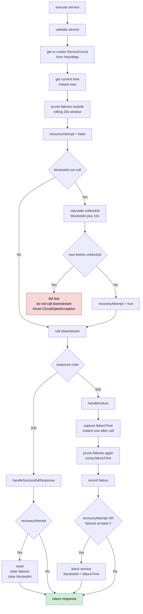

### Circuit Representation

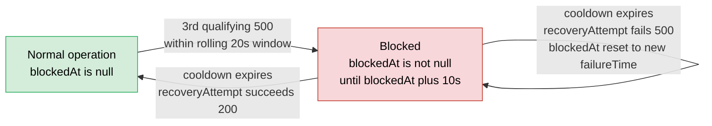

> Note: cooldown expiry does not change state by itself — it only flips `recoveryAttempt = true` on the next incoming request. There is no explicit `HALF_OPEN` state.

### Recovery Flow

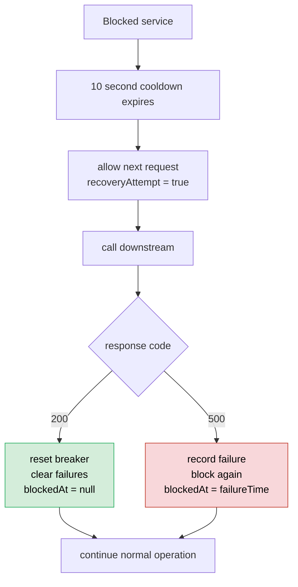

## Phase 2

### Main Execution Flow

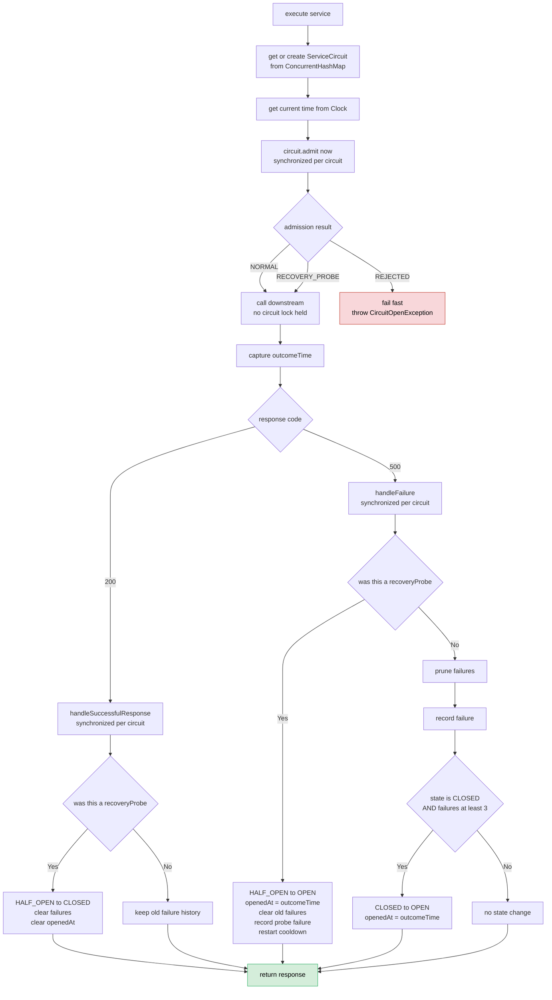

### State Machine

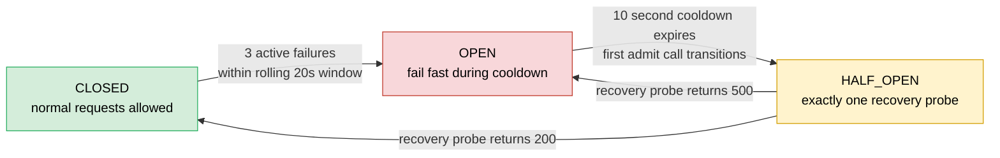

### Concurrency — Cooldown Expiry With 20 Simultaneous Requests

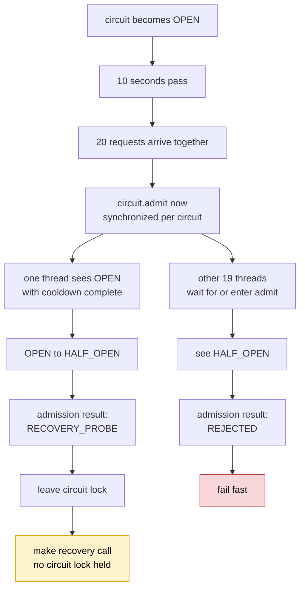

## Phase 3

### Main Execution Flow

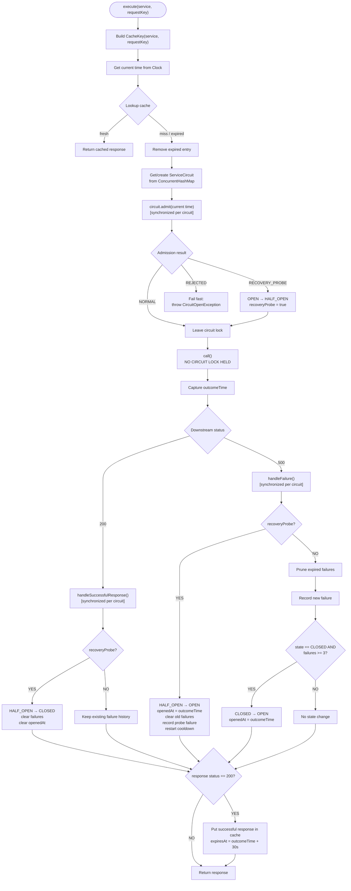

### Cache Rules

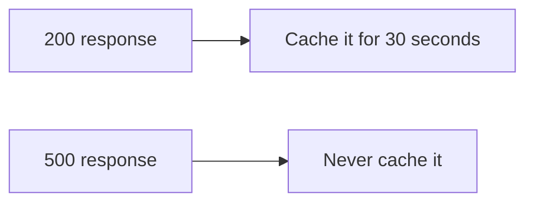

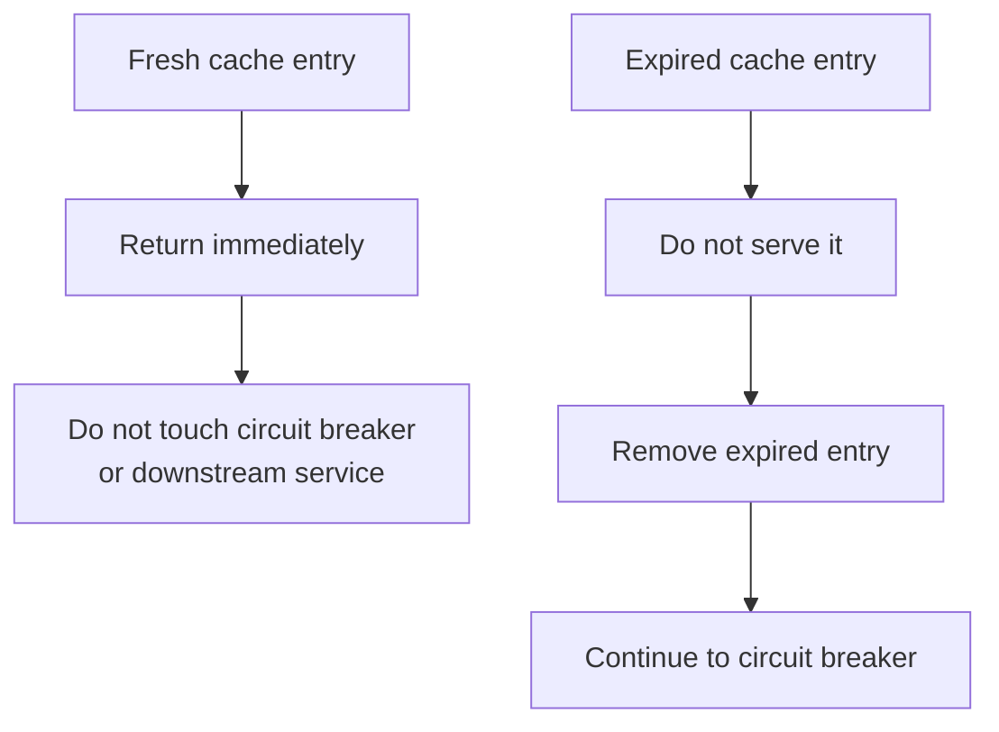

### Circuit State Machine

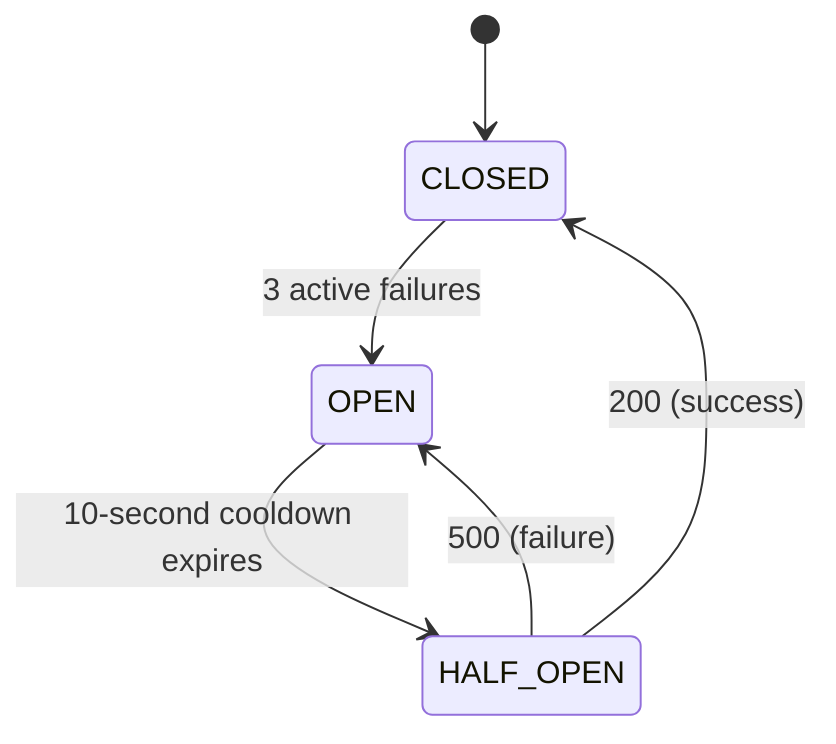

### Description

Stage 3 places a thread-safe 30-second TTL response cache in front of the Stage 2 circuit breaker.

A fresh cached `200` response is returned immediately without consulting the circuit breaker or calling the downstream service. Cache misses and expired entries fall through to the breaker. Circuit admission and state transitions remain synchronized per downstream service, while the remote call itself is always performed outside the circuit lock. Only successful `200` responses are cached.

### Assumptions

#### 1. Stage 1 and Stage 2 breaker behaviour remains unchanged

- `200` is treated as success.
- `500` is the only qualifying failure.
- Three qualifying failures within the active rolling 20-second window open the circuit.
- The active failure window is `(now - 20 seconds, now]`.
- A failure exactly 20 seconds old is expired.
- Circuit-breaker state is independent per downstream service.
- The `OPEN` cooldown is 10 seconds.
- Circuit states are explicit: `CLOSED`, `OPEN`, and `HALF_OPEN`.
- Exactly one request may transition `OPEN -> HALF_OPEN` and act as the recovery probe.
- While `HALF_OPEN`, other callers fail fast.
- A successful recovery probe performs `HALF_OPEN -> CLOSED`.
- A failed recovery probe performs `HALF_OPEN -> OPEN` and restarts the cooldown.

#### 2. Cache lookup happens before circuit-breaker admission

- Stage 3 always checks the response cache before calling `ServiceCircuit.admit(...)`.
- A fresh cache hit returns immediately.
- Therefore, a fresh cached response can still be served even when the service's circuit is `OPEN` or `HALF_OPEN`.
- On a fresh cache hit, neither the breaker nor the downstream service is touched.

#### 3. Cache entries are scoped by service and request key

- The cache key is:

```text
(service, requestKey)
```

- Two request keys for the same service are different cache entries.
- The same request key used for different services is also treated as a different cache entry.

Example:

```text
("ServiceB", "account-123")
```

is different from:

```text
("ServiceB", "account-456")
```

#### 4. Cache TTL is 30 seconds

- Successful responses remain fresh for 30 seconds.
- An entry is fresh only while:

```text
now < expiresAt
```

- At exactly `expiresAt`, the entry is expired.
- Expired entries are not served.

#### 5. Only successful responses are cached

- A downstream `200` response is cached.
- A downstream `500` response is never cached.
- The cache expiry timestamp is based on `outcomeTime`, the time at which the downstream result is observed.

#### 6. Cache eviction is lazy

- Expired entries are removed when that exact cache key is accessed again.
- There is no active background TTL sweep in this Stage 3 implementation.
- The cache is not bounded by a maximum size.
- For long-running production use, a bounded cache or active expiry mechanism would be required to avoid growth from one-off request keys.

#### 7. Expired cache removal is concurrency-safe

- When an expired entry is observed, the implementation removes only that exact cached value:

```text
cache.remove(cacheKey, cached)
```

- If another thread has already replaced the entry with a newer value, that newer value is not accidentally removed.

#### 8. Circuit admission is atomic per service

- `ServiceCircuit.admit(...)` is synchronized.
- State inspection, rolling-window cleanup, cooldown checks, and `OPEN -> HALF_OPEN` admission happen atomically for one service.
- Synchronization is per `ServiceCircuit`, so unrelated downstream services do not share the same lock.

#### 9. The downstream call is never made while holding the circuit lock

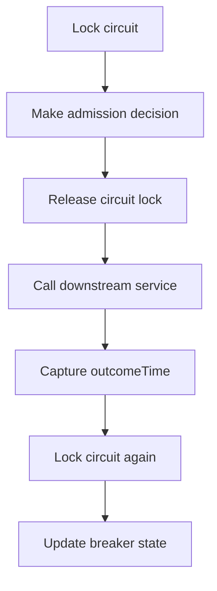

- Network latency therefore does not keep the per-service circuit lock held.

#### 10. Breaker outcome handling is synchronized

- `handleSuccessfulResponse(...)` is synchronized.
- `handleFailure(...)` is synchronized.
- This means breaker state is protected both when a request is admitted and when its downstream result is applied.

#### 11. Normal successful responses do not clear failure history

- A normal `200` while the circuit is `CLOSED` does not remove previous active failures.
- Only a successful recovery probe resets the breaker and clears its previous failure history.

#### 12. Failed recovery starts a fresh failure history

When a `HALF_OPEN` recovery probe returns `500`:

```text
HALF_OPEN -> OPEN
```

and the implementation:

- sets `openedAt = outcomeTime`;
- clears the old failure history;
- records the failed recovery probe as the first failure in the new history;
- restarts the 10-second cooldown.

#### 13. Normal failures only perform `CLOSED -> OPEN`

For a non-recovery `500`, the breaker:

1. prunes expired failures using `outcomeTime`;
2. records the new failure;
3. opens the circuit only when:

```text
state == CLOSED && failures >= 3
```

This guard matters because another request may already have changed the circuit state while this request was in flight.

#### 14. Existing in-flight CLOSED requests are not cancelled

- Multiple `CLOSED` requests may already be calling the downstream service concurrently.
- If another request opens the circuit while they are in flight, Stage 3 does not cancel those existing calls.
- Their results are still processed when they complete.

#### 15. Time comes from an injected Clock

- Rolling-window boundaries, cooldown boundaries, and cache TTL boundaries all use the injected `Clock`.
- This allows exact time-dependent behaviour to be tested deterministically.

#### 16. Thread safety is local to this JVM

- `ConcurrentHashMap` protects the shared circuit/cache maps in this process.
- Per-service breaker transitions are synchronized inside `ServiceCircuit`.
- No distributed/shared circuit-breaker state is implemented across multiple JVM instances.

#### 17. Supplied downstream call remains opaque

- `call()` is treated as supplied remote-call behaviour.
- Circuit-breaker and caching logic are implemented around it rather than inside it.

#### 18. Backwards-compatible execute overload

The implementation also supports:

```java
execute(String service)
```

which delegates to:

```java
execute(service, service)
```

Therefore, when that overload is used, the service name also becomes the request cache key.
